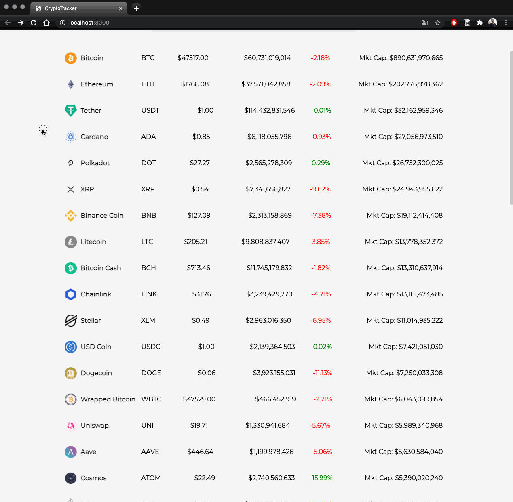

## CryptoTracker
**CryptoTracker** is a basic cryptocurrency market tracker, which lists the top 50 coins (ordered by market cap), along with trading charts to analyze the performance of the coin.

For each coin, you can also find the following properties:
* Daily percent change
* Current price
* All time high
* Market cap
* Block time
* Hashing algorithm
* Volume

## Workflows
### Coin search
By default, the top 50 coins are ordered by market cap. If a coin is hard to find, just use the search bar!


### Chart interaction
After selecting a coin, feel free to interact with the chart however you wish! Things such as adjusting the candle size, chart type, and adding pattern indicators, is super intuitive.


### Getting started
Run the development server, using `npm` or `yarn`:

```bash
# using npm
npm run dev

# alternatively, using yarn
yarn dev
```

Open [http://localhost:3000](http://localhost:3000) in your browser to see the project!


### Miscellaneous
This is a [Next.js](https://nextjs.org/) project bootstrapped with [`create-next-app`](https://github.com/vercel/next.js/tree/canary/packages/create-next-app).
